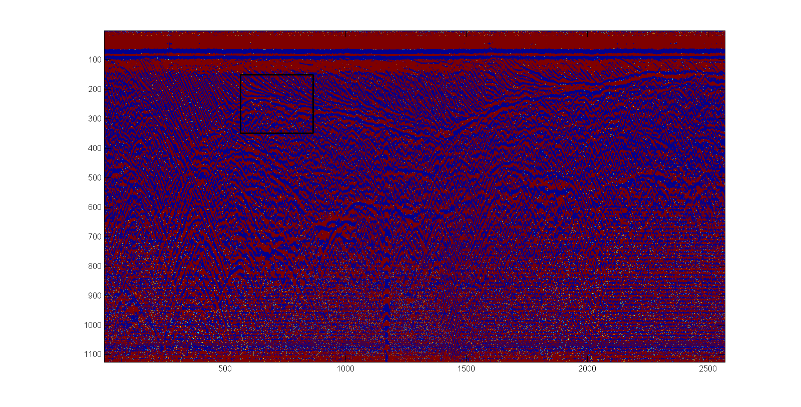
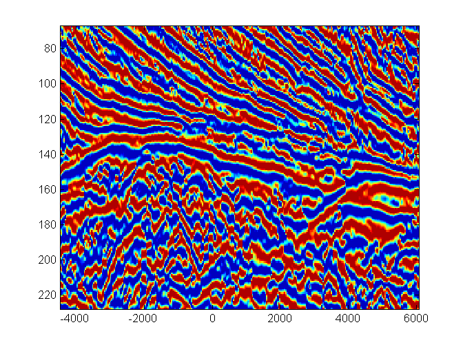
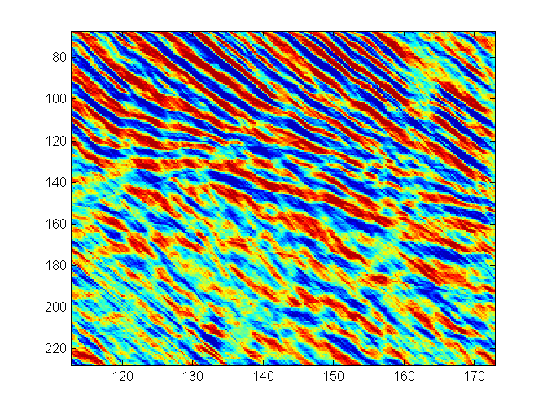
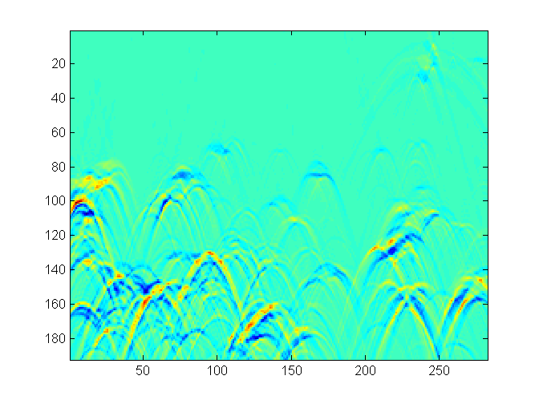
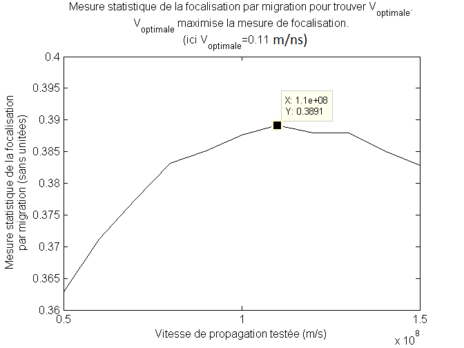

# GPR data processing
Processing of ground penetrating radar (GPR) data using Matlab and the CREWES library, an open-source (mostly) seismic data processing library. Amongst other things, this is an implementation of the method described in [Harlan et al., Geophysics, vol 49, no. 11, 1984](https://library.seg.org/doi/pdf/10.1190/1.1441600). It is applied to georadar data to filter horizontal beds and diffractions and to estimate wave velocities.

# Work in progress

Decembre 10, 2017: The repo is a total mess. It is not quite usefull for anyone else but me as is ;). This is a quick and dirty implementation of Harlan et al.'s method I did in 2015 for velocity analysis of GPR data. It seemed to work pretty well on good GPR data (see next section) but is totally unoptimized.

1) Cleaning up the code, creating some sort of documentation and improving comments. A lot of m-files are not relevent to the implementation either. Need to dig back into the article.
2) I had to modify the code of the fk-migration in the CREWES library for the migration to work on time series not starting at t=0. But I did not save this modification at the time -_-. Need to figure it out from scratch. Should not be to bad.
3) The code makes use of the kernel density estimation (KDE) for some deconvolution. I used code by [Z. I. Botev](https://arxiv.org/abs/1011.2602). As I recall, this KDE step was the bottle neck of the implementation in terms of running time. This has to be investigated for optimization.

# Background 

This was a quick and dirty implementation of Harlan et al.'s method that seemed to work on GPR data. The method was tested on the following preprocessed GPR profile (dewow, filtering and adaptative gain) which was performed over a dry (and partially frozen) deltaic sand formation. The black box shows the regions on which the Harlan et al.'s method was applied.

This is a close-up of the region-of-interest before processing, i.e, the original image:

This is the result of the 1st step of the processing, namely the extraction of linear structures such as sedimentary inclined beds:

The extracted beds are then substrated from the original. This new "filtered" image then goes to the 2nd processing step which is meant to extract the diffraction patterns. The following image shows the result of this extraction:

Once the diffractions are extracted, a velocity analysis can be performed using a migration focalisation metric. The following graphs shows the focalisation metric value as a function of wave velocity. The higher the metric, the closer the velocity is to the real velocity. In this case we find the best velocity around 0.11 m/ns as expected for dry sands.

